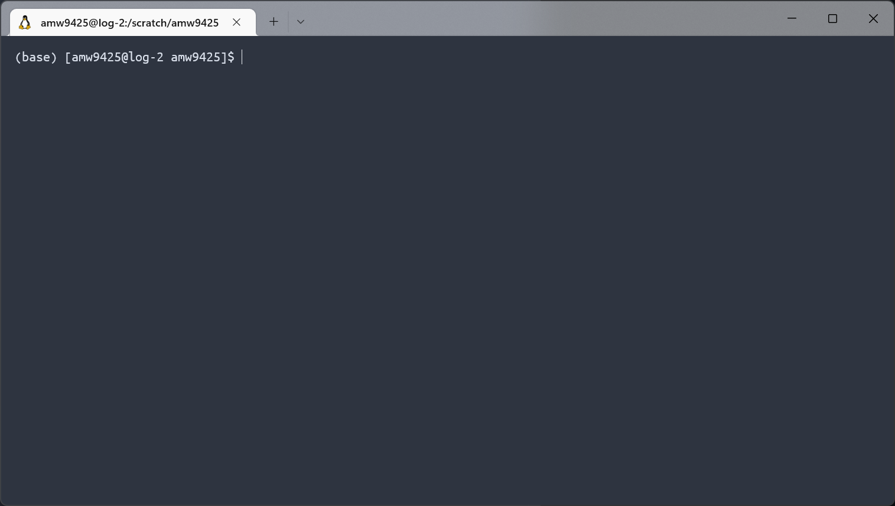

# NYU Compute Cluster Documentation for ROB-GY 6203 Robot Perception

Author: Aditya Wagh (amw9425@nyu.edu)

This documentation is fairly primitive and is intended to introduce you to NYU's Computing Resource Support. For specific information, please refer to the [HPC Documentation](https://sites.google.com/nyu.edu/nyu-hpc). There is a search button on the top right part of this page.

## How to access compute resources for Robot Perception?

Since all of you already have access to HPC, you need to remotely acess the cluster shell (terminal where you input commands). You **need to be connected to the NYU network via a VPN or by being physically being on-campus.** to access the cluster shell.

Use the command below to log in to the HPC Cluster. It will ask you for your password. Enter the password that you use for logging in using your NetID. It will also ask you something related to fingerprint, type `yes` if that prompt shows up. This is to add the cluster in the list of trusted computer.

```bash
ssh <netid>@greene.hpc.nyu.edu
```


After this step, your prompt will look like this, except the `(base)` part. That is something specific to my shell. By default, you are in the `/home/<netid>/` or `~` folder. `log-2` represents the name of the login node, There are three login nodes: `log-1`, `log-2` and `log-3`.



Now you need to hop to NYU HPC's Google Cloud Bursting nodes intended for use in coursework. To do that, use the following snippet. Don't run jobs on NYU Greene since it's intended only for research purposes.

```bash
ssh burst
```

`log-burst` is the login node for the HPC's GCP Burst cluster. **You have to do the next steps in this cluster.**


## Installing Conda on HPC

HPC documentation recommends using singularity to setup conda enviromments, however it's quite complicated and not easy for beginners. I prefer the method mentioned below, that allows us an alternative to the singularity process.

### **Step 1:** Create directory for your conda installation

```bash
mkdir /scratch/<NetID>/miniconda3
```

We don’t want to create the environment in the home directory because of the 50GB quota limit in the `/home/<netID>/`folder.

### **Step 2:** Download and install Miniconda

```bash
wget https://repo.continuum.io/miniconda/Miniconda3-latest-Linux-x86_64.sh
sh Miniconda3-latest-Linux-x86_64.sh -b -p /scratch/<NetID>/miniconda3
```

### **Step 3:** Create script to activate Miniconda

Create a script ``env.sh`` in `/scratch/<NetID>/` using the command the command below.

```bash
touch /scratch/<netID>/env.sh
```

Now populate the `env.sh` file with the following contents. Use can use `vim, vi, emacs, nano` or any other favourite terminal text editor. Read more about how to use terminal editors. This is beyond the scope of this document.

```bash
#!/bin/bash

source /scratch/<NetID>/miniconda3/etc/profile.d/conda.sh
export PATH=/scratch/<NetID>/miniconda3/bin:$PATH
export PYTHONPATH=/scratch/<NetID>/miniconda3/bin:$PATH
```

Now, you can activate your conda package manager by doing

```bash
source /scratch/<NetID>/env.sh
```

By default, new conda environment and packages will be stored in `/scratch/<NetID>/miniconda3`

## How to request for GPU nodes and run your code?

There are 2 ways to do this, one is interactive and one is non-interactive.

- **Interactive Mode:** In interactive mode, you can execute your code files just like you would on a terminal. To request for a interactive compute node, you have to use the `srun` command. To request a Tesla v100 GPU node with 2 CPUs for 4 hours, the following is the command you have to use. This will give you a terminal shell using which you can run your code just like you would on your computer.

```bash
srun --account=rob_gy_6203-2022fa -cpus-per-task=2 --partition=n1s8-v100-1 --gres=gpu:v100:1 --time=04:00:00 --pty /bin/bash
```

- **Non-Interactive Mode:** In Non-Interactive mode, you will submit a job which will be put in a queue. The processing of jobs in queue is automatically handled by the [SLURM workload manager](https://slurm.schedmd.com/documentation.html). This can be done using the following command.

```bash
sbatch run-test.sbatch
```

Contents of `test.sbatch`

```bash
#!/bin/bash
#SBATCH --account=rob_gy_6203-2022fa    # ask for robot perception nodes
#SBATCH --partition=n1s8-v100-1         # specify the gpu partition
#SBATCH --nodes=1                       # requests 1 compute server
#SBATCH --ntasks-per-node=1             # runs 1 task on each server
#SBATCH --cpus-per-task=2               # uses 2 compute cores per task
#SBATCH --time=1:00:00                  # for one hour
#SBATCH --mem=2GB                       # memory required for job
#SBATCH --job-name=torch-test           # name of the job
#SBATCH --output=result.out             # file to which output will be written
#SBATCH --gres=gpu:v100:1               # To request specific v100 GPU

## Initialize conda
source /scratch/amw9425/env.sh;

## activate your environment
conda deactivate; ## this is needed for some reason, which I don't know yet
conda activate torch;

## run your code
python test.py;

```

Contents of `test.py`

```python
#!/bin/env python

import torch

print(torch.__file__)
print(torch.__version__)

# How many GPUs are there?
print(torch.cuda.device_count())

# Get the name of the current GPU
print(torch.cuda.get_device_name(torch.cuda.current_device()))

# Is PyTorch using a GPU?
print(torch.cuda.is_available())
```

Common commands associated with non-interactive jobs

- `squeue -u <netID>` or `squeue --me` : See the jobs you have submitted.
- `scancel <JobID>` : Cancel a job; the JobID number can be seen using the `squeue` command.
- `scancel {StartJobId..EndJobId}` : Cancel jobs in range
- `squeue -u $USER | awk '{print $1}' | tail -n+2 | xargs scancel` : Cancel all your jobs
- `squeue --me --start`: See the estimated start time of your job
